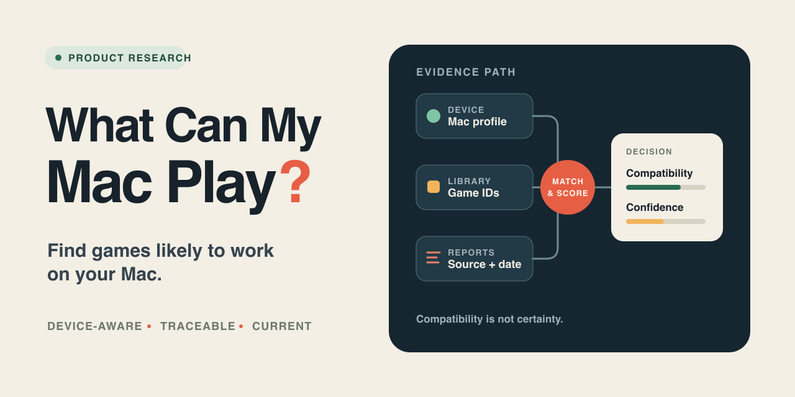

# What Can My Mac Play?

[简体中文](README.zh-CN.md)

An evidence-aware Mac game compatibility prototype. It is designed to help players understand which games are likely to work on their specific Mac—and why—without treating a single compatibility rating as a guarantee.

[Open the live MVP](https://macplay.onovich.com)



## What the project aims to do

- Match a player's Steam library against available Mac compatibility evidence.
- Model the environment behind each report, including Apple silicon, macOS, CrossOver, and graphics backend details.
- Keep compatibility and confidence as separate scores so sparse or conflicting evidence remains visible.
- Summarize reproducible configurations while preserving source links, dates, and claim boundaries.
- Prefer a native Mac version when it is the simpler supported route.

## Current status

The repository is in the **interactive MVP and data-feasibility phase**. The deployed Vite/React prototype includes browser-language detection with a persisted language choice, a local Mac profile selector, searchable evidence samples, stable game detail URLs, a three-state My Library interaction preview, explicit source links, and automated tests.

The sample catalog remains static and comes from the repository's point-in-time research. A Cloudflare Worker now provides a tested Steam app-list boundary and a fail-closed owned-games boundary, but the live owned-games feature is deliberately disabled until rate limiting, approved test accounts, and privacy copy are ready. There is no user account system or automated compatibility-data ingestion pipeline.

## Run locally

Requirements: Node.js 22.12 or newer and pnpm 11.7 or newer.

```sh
pnpm install --frozen-lockfile
cp .env.example .env.local
pnpm dev
```

The development server prints its local URL. `VITE_SITE_URL` controls the canonical production URL and defaults to `https://macplay.onovich.com`.

Run the full validation suite with:

```sh
pnpm check
```

## Repository contents

- [`WHAT_CAN_MY_MAC_PLAY_HANDOFF.md`](WHAT_CAN_MY_MAC_PLAY_HANDOFF.md) — product definition, evidence model, MVP scope, risks, and phased delivery plan.
- [`steam-crossover-research.md`](steam-crossover-research.md) — a point-in-time local research snapshot that demonstrates why version, environment, and evidence freshness matter.
- [`src/`](src/) — the responsive React prototype, sample evidence data, and component tests.
- [`worker/`](worker/) — bounded, server-side Steam API connectors and route tests; the Web API key stays in a Worker secret.
- [`sources.yml`](sources.yml) — allowed fields, retention rules, attribution, and permission status for each researched data source.
- [`docs/social-preview-ledger.yml`](docs/social-preview-ledger.yml) — evidence and design decisions behind the repository cover.

## Planned MVP

The proposed MVP focuses on Apple silicon Macs, Steam, and CrossOver:

1. Search and browse evidence-backed game compatibility pages.
2. Create a Mac profile with chip, memory, macOS, and CrossOver details.
3. Match a user-authorized public Steam library.
4. Show compatibility, confidence, known blockers, recent evidence, and source links.
5. Explain conflicting or stale reports instead of hiding them behind one score.

The initial validation target is 50 representative games, followed by an internal 100–200 game prototype. Expansion to 500–1,000 public pages depends on data rights and evidence quality.

## Data and accuracy boundaries

The product is intended to aggregate cited third-party reports; it is not an independent testing laboratory. Compatibility depends on hardware, macOS, runner version, graphics backend, game updates, launchers, DRM, and anti-cheat systems.

Technical access does not imply permission to cache or republish data. Each source must have a documented license or approved usage path before production ingestion. The project never requests a Steam password; any future SteamID lookup must be explicitly initiated by the user and must not persist the identifier or raw response.

## Documentation

The detailed [handoff document](WHAT_CAN_MY_MAC_PLAY_HANDOFF.md) records product decisions, evidence boundaries, and the roadmap. Connector safety notes are documented for the [app list](docs/steam-app-list-connector.md) and [owned-games lookup](docs/steam-owned-games-connector.md). The MVP uses `macplay.onovich.com` before any move to a standalone domain.

## License

No open-source license is currently included in this repository.
