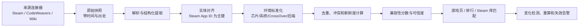

# What Can My Mac Play? 项目交接文档

> 状态：Phase 0 / 可运行前端原型已建立，实时数据接入尚未开始
> 文档日期：2026-09-02（Asia/Shanghai）
> 目标：让接手者无需读取原对话，也能理解项目的来由、决定、证据、风险与下一步。

## 1. 执行摘要

**What Can My Mac Play?** 是一个面向 Mac 玩家、以自动化信息聚合为主的游戏可玩性决策网站。它不自行雇人测试游戏，也不依赖高强度社区运营；其工作是把 Steam、CodeWeavers 兼容性中心及其他 Mac 游戏兼容性资料，按游戏、设备、运行方式和测试时间归一化，回答：

> “我这台 Mac、这个系统与 CrossOver 版本，现在最可能稳定玩哪些游戏？结论依据是什么？”

项目不应退化为“复制一份 CrossOver 兼容列表”。现有网站已经覆盖了基础查询：CodeWeavers 自称其兼容性数据库有数万款 Windows 应用，并有官方/用户测试；AppleGamingWiki、MacGamingDB、Does It Mac 与 Whisky 也各自提供兼容性资料。项目的差异化应集中在：

1. 自动匹配用户自己的 Steam 游戏库；
2. 用统一环境模型表达芯片、macOS、CrossOver、图形后端与游戏版本；
3. 对多来源结论计算“兼容性分数 + 可信度”，明确证据新鲜度与冲突；
4. 把零散报告提取成可复现的配置摘要；
5. 将兼容性、Steam 好评率与标签结合，支持“值得玩且可能跑得好”的发现型搜索。

当前明确决定：

- 主品牌：**What Can My Mac Play?**
- MVP 地址：`macplay.onovich.com`
- 独立域名购买暂缓；验证 MVP 后再评估 `whatcanmymacplay.com`
- 不购买 `macgamecheck.com`
- GitHub 仓库建议名：`what-can-my-mac-play`
- 产品初期只做信息聚合与自动分析，不承诺人工复测、论坛或人工技术支持。

当前工程进度：仓库已经包含基于 Vite、React 与 TypeScript 的响应式前端原型，提供设备画像选择、可搜索的静态研究样本和证据外链。尚未实现 Steam 连接、实时兼容数据、后端 API、用户系统或生产部署。

## 2. 问题与产品定位

### 2.1 用户问题

Mac 玩家面对的不是一个二元的“能不能启动”，而是一个多变量问题：

- 同一游戏可能在 M1 上可玩、在新芯片或新 macOS 上出现回退；
- 同一 CrossOver 大版本的不同小版本，结果可能不同；
- DXVK、D3DMetal、DXMT、WineD3D 等后端可能决定能否进入游戏；
- “可以启动”不等于过场、声音、手柄、存档、联机或反作弊正常；
- 游戏更新、启动器升级和 DRM 变化可能令旧报告快速失效；
- 用户通常还要在 Steam 评价、游戏标签和兼容性网站之间来回比对。

CodeWeavers 的官方评级定义也说明了这种信息损失：4 星 “Runs Well” 仍可能有小问题，而且官方明确表示其数据库不会逐应用维护所有具体功能的可用/不可用清单；用户要另外查论坛。[CodeWeavers 评级说明](https://www.codeweavers.com/compatibility/rating-system)

### 2.2 产品定位

建议定位：

> **Mac 游戏兼容性搜索与决策引擎**，而不是测试实验室或泛游戏媒体。

英文价值主张可用：

> **Find games that actually work on your Mac.**

更精确的产品承诺：

> 输入 Mac 配置并连接/导入 Steam 游戏库，系统基于近期公开证据，列出最可能稳定运行的游戏、已知问题、推荐运行方式和判断置信度。

### 2.3 为什么现在仍有空间

截至本次核对：

- [CodeWeavers Compatibility Center](https://www.codeweavers.com/compatibility/) 是官方售前兼容查询和支持入口，页面称团队每月测试大量 Windows 程序，也接收用户提交；它按应用查询，不以 Steam 玩家发现、个人库存匹配和跨来源分析为中心。
- [AppleGamingWiki 的 M1 CrossOver 列表](https://www.applegamingwiki.com/wiki/M1_CrossOver_Windows_compatible_games_list)显示 826 款游戏，采用 Perfect / Playable / Runs / Menu 等粗粒度状态。
- [MacGamingDB](https://macgamingdb.app/)主打 Apple Silicon、FPS/benchmark 和 CrossOver、Parallels、GPTK 等运行方式，已是直接竞品。
- [Does It Mac](https://doesitmac.com/)比较 Native、Rosetta、CrossOver、Parallels 等方式，并强调内容证据门槛，也是直接竞品。
- [Whisky Game Support](https://docs.getwhisky.app/game-support/)明确说明其列表和修复方案都不完整，评级还部分依赖文章作者判断。

因此，市场空白不是“网上没有表格”，而是缺少一个对普通用户足够个性化、可追溯、能处理时效和冲突的自动决策层。

## 3. 目标用户与 JTBD

### 3.1 首要用户

1. 已拥有大量 Steam Windows 游戏、刚换 Apple Silicon Mac 的玩家；
2. 正考虑购买某款游戏，但不知道 Mac 上哪种运行方式可用的人；
3. 已购买 CrossOver，希望减少下载、安装和排障试错的人；
4. 愿意做少量配置，但不愿阅读多篇 Wiki、论坛和零散评论的人。

### 3.2 Jobs To Be Done

- **库存筛选**：当我想在 Mac 上玩游戏时，告诉我已购库里哪些最值得先安装。
- **购买前检查**：当我看到一款 Steam 游戏时，告诉我在我的 Mac 上成功运行的概率和限制。
- **配置复现**：当游戏无法正常启动时，给我近期有人报告成功的环境组合，而不是笼统评级。
- **方案选择**：若有原生 Mac 版、Rosetta、CrossOver、Whisky、Parallels 等路径，优先指出阻力最低的一种。
- **风险识别**：在下载几十到上百 GB 前，提醒反作弊、启动器、DRM、联机、过场和存档风险。

## 4. 竞品与产品空白

| 产品 | 主要价值 | 优势 | 可利用的空白 |
|---|---|---|---|
| CodeWeavers Compatibility Center | CrossOver 官方售前查询、评级、测试和社区报告 | 官方、与 CrossOver 产品及支持链路紧密 | 不以个人 Steam 库、跨来源、游戏标签/好评发现为中心；功能问题粒度有限 |
| AppleGamingWiki | Apple Silicon 多运行方式 Wiki | 条目多，兼容状态直观，部分页面含设备证据 | 表格/Wiki 导向；新鲜度、环境匹配和跨来源置信度不足 |
| MacGamingDB | Mac 游戏兼容性与 benchmark | 已有 FPS、芯片与运行方式筛选 | 需要通过库存匹配、证据冲突、自动配置提取形成更明确差异 |
| Does It Mac | Apple Silicon 应用/游戏兼容数据库 | 路径对比、内容质量门槛 | 游戏发现和 Steam 库工作流仍可深化 |
| Whisky Docs | Whisky 的社区游戏支持与修复指南 | 配置步骤具体 | 明确不完整、偏 Whisky、依赖人工贡献 |
| PCGamingWiki | PC 游戏技术问题、DRM、配置资料 | 技术深度和结构化知识强 | 不是以 Apple Silicon/CrossOver 决策为核心 |

**Go / No-Go 判断：**

- 若首版只是“游戏列表 + 好评率排序 + 标签筛选”，不建议重投入，差异太薄。
- 若能做“Steam 库匹配 + 精确环境 + 新鲜度/冲突/可信度 + 可追溯配置摘要”，值得做验证。

## 5. 数据源、接入方式与授权风险

原则：**技术上能请求，不代表允许批量缓存、二次发布或商业化。** 每个来源上线前都要建立 source registry，记录服务条款、许可、robots、抓取频率、缓存期限、归因方式和下架机制。

### 5.1 Steam

优先使用官方文档明确支持的接口：

- [Steamworks Web API 概览](https://partner.steamgames.com/doc/webapi_overview)：公共接口与受保护接口并存；密钥不得暴露在客户端。
- [IStoreService/GetAppList](https://partner.steamgames.com/doc/webapi/IStoreService)：用任意 Web API key 获取公开应用清单，可按修改时间增量同步，是 Steam App ID 主数据的候选入口。
- [IPlayerService/GetOwnedGames](https://partner.steamgames.com/doc/webapi/IPlayerService)：在有权查看用户游戏详情时返回其拥有的游戏；产品必须把“用户资料/游戏详情是否公开”当成正常分支，不能假设所有账号都能读。
- [User Reviews - Get List](https://partner.steamgames.com/doc/store/getreviews)：官方文档给出 `store.steampowered.com/appreviews/<appid>?json=1`，可获取评论及查询摘要；不需要复制评论正文即可使用汇总数字。
- [Steam 用户评论说明](https://partner.steamgames.com/doc/store/reviews)：Steam 展示近期与终身汇总分数，并解释只有满足其条件的购买者评价计入商店分数。
- [Steam Web API Terms of Use](https://steamcommunity.com/dev/apiterms)：要求密钥保密、按隐私政策处理非公开用户数据、只在用户请求时读取其数据、告知存储情况、不得暗示 Valve/Steam 背书；条款还写有每日 100,000 次调用上限，并保留变更或终止接口的权利。

实施建议：

- 库连接首版可让用户输入 SteamID/公开个人资料链接；清楚说明库需可见。
- 不接收、不代理、不保存 Steam 密码。
- API key 只放服务端 secret manager；为每位用户提供“断开并删除库存快照”。
- 尽量只存 App ID、同步时间和必要的用户偏好；游戏时长若非核心，不要默认长期保存。
- 好评率只存可重新计算的摘要与抓取时间，不抓取/再发布大段用户评论正文。

### 5.2 CodeWeavers

[CodeWeavers Compatibility Center](https://www.codeweavers.com/compatibility/)称数据库包含官方和用户报告，并提供筛选、评级、测试/投票与论坛。它是 CrossOver 兼容证据的首要来源，但未发现面向本项目的公开数据 API 或明确允许批量商业再发布的开放许可。

首版策略：

1. 联系 CodeWeavers 请求 API、数据合作或书面许可；
2. 未获许可前，以“有限事实字段 + 原页深链 + 抓取时间”为候选设计，避免复制长篇测试/论坛文本；
3. 遵守 robots.txt、限速和删除请求；
4. 将其评级标记为来源观点，不包装成本网站验证结果；
5. 联盟合作与数据授权是两件事，加入 affiliate 不自动获得数据库转载权。

### 5.3 AppleGamingWiki

AppleGamingWiki 页面页脚声明内容在未另行注明时采用 **Creative Commons Attribution-NonCommercial-ShareAlike**。这意味着商业产品不能把其内容许可想当然地直接混入闭源商业数据库；NC 与 SA 的适用范围、数据库权利和派生内容边界需要法律核对。[页面许可示例](https://www.applegamingwiki.com/wiki/AppleGamingWiki%3AEditing_guide)

建议：先只保存页面 URL、有限的事实映射和自身计算结果；如准备商业化，联系站方取得许可或明确隔离 CC BY-NC-SA 数据集及其归因/同许可输出。

### 5.4 Whisky

[Whisky Game Support](https://docs.getwhisky.app/game-support/)是社区可编辑的非穷尽列表，评级部分依赖作者判断。其 GitHub 仓库许可需在接入前按具体仓库和文件复核，不能仅凭“开源项目”推断文档内容可自由商业复用。

### 5.5 MacGamingDB 与 Does It Mac

二者都应视为竞品而非默认免费数据源。公开页面可用于竞品研究和提供外链；没有明确 API/开放许可前，不批量复制其报告、评分或 benchmark。若数据对 MVP 很关键，优先商务合作或询问数据导出许可。

### 5.6 PCGamingWiki、反作弊与其他来源

可考虑的数据包括 DRM、启动器、反作弊、原生平台支持等，但必须逐项核对许可与 API。任何基于论坛、Reddit、GitHub issue 或视频的自动摘要，都要保留 URL、作者/日期和“非独立验证”标签，并避免复制受版权保护的长文本。

### 5.7 域名与注册价格

域名价格、优惠和可注册状态都是时点信息，购买时以注册商结算页为准。GoDaddy 官方也提醒续费费率可能高于首购价，并建议在账户 Domain Portfolio 中查看实际一年续费价；续费价不含附加服务。[GoDaddy 续费价检查说明](https://www.godaddy.com/zh-sg/help/check-my-domain-renewal-price-26950)

当前策略：

- MVP 先使用 `macplay.onovich.com`，暂不购买独立域名；
- 产品验证通过后，优先重新评估 `whatcanmymacplay.com`，不默认同时购买多个域名；
- 核对首购年限、续费价、税费、ICANN 费用和是否为 Premium；
- 不默认购买收费邮箱、建站、Premium DNS 或额外域名保护；
- 开启双因素认证、注册锁和自动续费，并记录转移资格日期。

## 6. 自动化数据管线



### 6.1 分层设计

1. **Source connectors**：每个来源独立适配，不让页面结构渗透到核心模型。
2. **Raw evidence store**：保存抓取时间、URL、HTTP 状态、许可版本与内容哈希；原文保留范围受许可约束。
3. **Identity resolution**：以 Steam App ID 为首要标识，辅以规范化名称、发行商、发布日期、商店 URL；低置信匹配进入隔离队列，不自动合并。
4. **Extraction**：规则优先，LLM 只从允许处理的文本中提取字段；每个字段必须指向 evidence ID。
5. **Normalization**：统一 Apple 芯片代际、内存、macOS、CrossOver/Wine 版本、Bottle、图形后端、分辨率和功能状态。
6. **Scoring**：将“可玩性”和“我们有多确定”分开计算。
7. **Serving index**：生成面向筛选和 SEO 的只读索引；用户库存数据与公共目录分库。
8. **Change detection**：新 CrossOver、macOS、游戏补丁或报告到来时，只重算受影响实体。

### 6.2 自动化但不过度自动断言

系统可以自动提取“报告中使用 DX11 并成功进入游戏”，但页面应写：

> “来源报告曾在此配置下成功；本站未独立验证。”

系统不应把一句模糊评论自动升级为“最佳配置”。任何推荐都应保留：来源、环境相似度、时间、样本数和冲突状态。

## 7. 建议数据模型

### 7.1 核心实体

```text
Game
  id, steam_app_id, canonical_title, aliases, developer, publisher,
  release_date, store_url, native_macos_available, tags

Source
  id, name, base_url, source_type, license, terms_url,
  robots_checked_at, allowed_usage, refresh_policy

Evidence
  id, game_id, source_id, source_url, source_record_id,
  observed_at, published_at, content_hash, evidence_type,
  extracted_fields, extraction_method, source_reliability

Environment
  id, device_model, chip_family, chip_variant, gpu_cores, memory_gb,
  macos_version, runner, runner_version, bottle_windows_version,
  graphics_backend, sync_mode, resolution, display_mode

CompatibilityReport
  id, game_id, evidence_id, environment_id, game_version,
  install_status, launch_status, gameplay_status, completion_status,
  fps_avg, fps_low, settings, severity, verdict, tested_at

FeatureStatus
  report_id, feature
  # feature: video/audio/controller/save/multiplayer/anticheat/launcher/mods
  status, notes, severity

ConfigRecipe
  id, game_id, environment_scope, steps_structured,
  launch_options, dependencies, provenance_evidence_ids,
  success_count, conflict_count, last_seen_at

AggregateScore
  game_id, target_profile_id, compatibility_score, confidence_score,
  steam_quality_score, setup_friction, performance_score,
  final_recommendation, calculated_at, algorithm_version

UserLibrary
  user_id, steam_id_hash, consent_version, synced_at, retention_policy

UserLibraryItem
  user_id, steam_app_id, owned, playtime_optional, synced_at
```

### 7.2 关键建模原则

- 评级属于“游戏 × 环境 × 时间”，不能只挂在游戏上。
- `Unknown` 与 `Unplayable` 必须分开；没有证据不是负面证据。
- `launch_status` 与 `gameplay_status` 分开，防止“能进菜单”被算作可玩。
- 单机、联机和反作弊分开；EAC/反作弊问题不能由单机成功报告覆盖。
- 所有聚合结论保留算法版本，便于回溯和重算。
- 原始事实与模型推断分开存储；页面可明确显示“来源事实 / 本站推断”。

## 8. 评分与可信度算法草案

### 8.1 两个分数，不合并语义

1. **Compatibility Score（0–100）**：现有证据认为它运行得多好。
2. **Confidence Score（0–100）**：这个判断有多可信。

界面示例：

> 可玩性 84 / 100 · 可信度 61 / 100（中等）
> 依据：3 个来源、7 份报告；最近一次 42 天前；2 份报告与目标设备高度匹配。

### 8.2 报告级权重

```text
report_weight =
  source_reliability
  × environment_similarity
  × freshness_decay
  × evidence_completeness
  × independence_factor
```

- `source_reliability`：官方结构化测试高于无环境信息的匿名评论，但不把官方来源自动设为绝对真理。
- `environment_similarity`：芯片、macOS、runner 版本、后端和内存越接近用户，权重越高。
- `freshness_decay`：建议半衰期 180 天；游戏/启动器频繁更新可缩短到 60–90 天。
- `evidence_completeness`：含版本、环境、帧率、功能项的报告高于只有“works”的报告。
- `independence_factor`：多个站点转载同一原始报告只算一个证据簇。

### 8.3 可玩性分数初稿

将报告映射为基础值，再加权聚合：

```text
perfect / runs great       95
playable / runs well       80
limited functionality      55
menu only / severe issues  30
fails to launch            10
will not install            0
unknown                  null
```

功能惩罚建议：

- 核心流程无法完成：-25
- 存档不可用：-25
- 关键过场导致阻塞：-20
- 联机/反作弊不可用：只降低“联机分”，不必同幅度惩罚纯单机分
- 启动器偶发问题：-5 至 -15
- 仅需简单启动参数：不降低兼容性，计入配置摩擦

### 8.4 可信度分数初稿

```text
confidence = 100 × (
  0.25 × source_diversity
  + 0.20 × effective_sample_size
  + 0.20 × freshness
  + 0.20 × target_environment_coverage
  + 0.15 × cross_source_agreement
)
```

建议显示等级：

- 80–100：高
- 60–79：中高
- 40–59：中
- 20–39：低
- 0–19：证据不足

必须做贝叶斯/样本收缩或等价处理：一条满分报告不能排在十条略低但一致的报告前。若来源冲突，可信度下降并展示冲突，不要由系统假装裁决。

### 8.5 发现榜单分数

初版可采用：

```text
recommendation_score =
  0.45 × compatibility
  + 0.20 × confidence
  + 0.20 × steam_review_score
  + 0.10 × performance
  + 0.05 × (100 - setup_friction)
```

这只是待验证假设。排行榜应支持切换“最稳”“最受好评”“最省配置”，不要把单一复合分数伪装成客观真理。

## 9. MVP 范围与非目标

### 9.1 MVP

- 500–1,000 款热门 Steam 游戏；优先 Windows-only、高搜索量、Mac 用户痛点强的游戏。
- 先接 2–3 个**授权路径明确**的数据源；Steam 官方接口是基础。
- 游戏详情页：Steam 评价/标签、运行路径、兼容分、可信度、最近证据、已知阻塞、来源链接。
- 浏览页：按标签、Steam 好评率、可玩性、可信度、芯片、CrossOver 版本筛选。
- 设备画像：芯片、内存、macOS、CrossOver 版本、偏好后端。
- Steam 库匹配：只读、需用户主动连接；私密库优雅失败。
- 数据新鲜度与来源冲突可视化。
- 静态/增量生成 SEO 游戏页，所有分数带更新时间。

### 9.2 明确非目标

- 不自行购买、安装和人工测试所有游戏；
- 不承诺 100% 兼容或提供官方支持；
- 不做论坛、Discord 社区运营或逐条人工审核；
- 不复制整篇 Wiki、论坛帖子、Steam 评论或竞品数据库；
- 不提供破解 DRM、绕过反作弊或规避平台限制的教程；
- MVP 不同时覆盖所有商店、Intel Mac、云游戏和所有兼容层；
- 不为“榜单数量”牺牲证据质量。

## 10. 信息架构与核心页面

### 10.1 首页

- H1：**What Games Can My Mac Play?**
- 主搜索框：输入游戏名
- 主 CTA：**Check My Steam Library**
- 设备选择：Mac 芯片 / 内存 / macOS / CrossOver
- 解释“可玩性”与“可信度”的区别
- 热门筛选入口：RPG、动作、独立、合作、无需复杂配置等

### 10.2 My Library

- 已拥有且推荐安装
- 已拥有但需要配置
- 报告冲突或证据不足
- 暂不建议尝试
- 已有原生 Mac 版，优先原生
- 每个结果显示预计下载成本、配置摩擦和最近验证时间（下载大小需有合法来源）

### 10.3 Browse / Rankings

筛选：类型标签、好评率、发行年、芯片、内存、运行方式、CrossOver 版本、图形后端、单机/联机、反作弊、可信度、配置难度。

排序：综合推荐、可玩性、可信度、Steam 好评率、最近更新、最少配置。

### 10.4 游戏详情页

1. 一句话结论与适用设备；
2. 可玩性 / 可信度 / Steam 评价；
3. 原生、Rosetta、CrossOver、Whisky、Parallels 等运行方式对比；
4. 环境矩阵；
5. 已报告成功配置；
6. 功能状态：过场、声音、手柄、存档、联机、反作弊、启动器；
7. 来源冲突和历史变化；
8. 全部证据链接及抓取时间；
9. 联盟链接明确标注。

### 10.5 方法论与透明度页

公开评分公式版本、来源类型、更新时间、纠错渠道、免责声明和数据删除请求入口。即使不做社区，也需要最低限度的纠错/下架邮箱。

## 11. SEO 策略

### 11.1 搜索意图

重点覆盖长尾而非只争夺 “Mac games”：

- `can [game] run on mac`
- `[game] crossover mac`
- `[game] m1/m2/m3/m4 mac`
- `[game] d3dmetal/dxvk settings`
- `best steam games for mac crossover`
- `what games can my mac play`

### 11.2 页面模板

- 标题：`Can [Game] Run on Mac? CrossOver Compatibility & Settings`
- H1：`Can [Game] Run on Apple Silicon Mac?`
- 首屏直接回答，同时给适用环境和证据日期。
- 内容必须包含该游戏独有的数据、冲突和配置，避免生成数千个只有换标题的薄页面。
- 对证据不足页使用 `noindex` 或不进入 sitemap，直到达到最低内容阈值。

### 11.3 技术 SEO

- 每个游戏以 Steam App ID 保证稳定 canonical slug；改名不产生重复页。
- MVP canonical 统一为 `https://macplay.onovich.com`；未来迁移独立域名时保持路径并逐页永久重定向。
- 自动 sitemap 分片、`lastmod` 来自实际证据/页面更新。
- SSR/静态生成，控制 Core Web Vitals；筛选参数默认 canonical 到主集合页，避免索引爆炸。
- 适当使用 `VideoGame`、`SoftwareApplication`、`FAQPage` 等结构化数据，但只标注页面真实可见内容，不把本站分数伪装成 Steam 官方评分。
- 游戏图像、商标和商店素材按 Valve/发行商许可使用；无法确认时使用文字和自有视觉。

## 12. 变现假设

### 12.1 首选：CrossOver 联盟

[CodeWeavers 2026 Affiliate Program Guide](https://media.codeweavers.com/pub/crossover/marketing/CW-2026_Affiliate_Program_Guide.pdf)写明：CrossOver+ 与 CrossOver Life 佣金均为 10%；佣金资格要求每季度至少带来 200 美元销售额，按季度结算，并需人工批准。示例中 74 美元销售对应 7.40 美元佣金。

执行要求：

- 兼容结果不能因为佣金而偏置；
- 所有 affiliate link 清楚披露；
- 不把加入联盟描述为 CodeWeavers 对本站的背书；
- 先验证自然搜索流量和点击意图，再估算 LTV，不用理论佣金证明项目必然回本。

### 12.2 次选

- 轻量广告：只在有规模后启用，避免破坏查询体验。
- 赞助/支持者：为无广告、收藏、变化提醒或高级筛选付费，但基础兼容信息不宜被完全锁住。
- B2B/API：长期可为媒体、Mac 软件商店或设备推荐工具提供聚合评分，但必须先解决上游数据再许可问题。

### 12.3 回本口径

- MVP 复用现有域名子域名，暂时没有新增域名现金成本。
- 若计入开发、数据接入、法律审查和持续维护，能否回本完全取决于自然搜索量、库存连接转化和联盟转化。
- 不应把域名视为投资品；它们是低成本产品资产。

## 13. 域名、仓库与品牌决定

### 13.1 已决定

- **MVP 地址**：`macplay.onovich.com`
- **独立域名**：当前不购买；MVP 验证后再决定是否购买 `whatcanmymacplay.com`。
- **未来迁移**：若启用独立域名，保留路径并将子域名永久重定向到新域名对应路径。
- **不购买**：`macgamecheck.com`
- **品牌显示**：`What Can My Mac Play?`
- **GitHub 仓库**：`what-can-my-mac-play`

仓库名选择理由：与品牌对应、GitHub slug 可读、比无连字符名称更适合作为代码仓库。若未来拆仓，可用：

- `what-can-my-mac-play-web`
- `what-can-my-mac-play-data`
- `what-can-my-mac-play-pipeline`

在只有一个仓库的 MVP 阶段，不要过早拆分。

### 13.2 商标风险

[Apple 第三方商标指南](https://www.apple.com/legal/intellectual-property/guidelinesfor3rdparties.html)允许在满足条件时将 “Mac” 与非通用词组合用于产品、公司或服务名，例如产品与 Mac 兼容、Mac 不比名称其余部分更突出、不暗示 Apple 关联、名称不与 Apple 商标混淆。指南还禁止未经许可使用 Apple Logo、模仿 Apple trade dress，且网站/宣传不得制造 Apple 背书印象。

`What Can My Mac Play?` 是否最终满足商标与域名要求，应在公开商业发布前由专业人士复核；本文不是法律意见。视觉上不要仿 Apple 官网，也不要使用 Apple Logo。

建议页脚：

> What Can My Mac Play? is an independent compatibility information service and is not affiliated with, authorized, sponsored, or endorsed by Apple Inc., CodeWeavers Inc., Valve Corporation, or any game publisher. Mac is a trademark of Apple Inc.; Steam is a trademark of Valve Corporation; CrossOver is a trademark of CodeWeavers Inc. Compatibility results are based on cited third-party reports and are not guarantees.

实际使用前应让法律顾问核对措辞、商标归属和适用地区。

## 14. 分阶段路线图

### Phase 0：可行性与授权（1–2 周）

- 配置 `macplay.onovich.com` DNS 与 HTTPS，并记录未来域名迁移方案；
- 创建 `what-can-my-mac-play` 仓库；
- 建 source registry，核对每个来源的许可、条款和 robots；
- 联系 CodeWeavers、AppleGamingWiki、MacGamingDB/Does It Mac，确认 API/合作/再发布边界；
- 用 50 款游戏验证实体对齐、数据缺口和评分输出；
- 做 Apple/Valve/CodeWeavers 商标与免责声明初步法律审查。

### Phase 1：内部数据原型（2–4 周）

- 接 Steam App List、Reviews 和少量获准兼容来源；
- 实现 raw evidence、identity resolution、环境归一化；
- 对 100–200 款游戏生成兼容分、可信度和冲突解释；
- 建人工只读审计页用于开发者 spot check，而非长期内容运营。

### Phase 2：公开 MVP（4–8 周）

- 500–1,000 款游戏详情页；
- 浏览、搜索、标签筛选、设备画像；
- Steam 公开库连接与隐私删除；
- 方法论、来源、免责声明、隐私政策、affiliate disclosure；
- SEO sitemap、canonical、性能监控和数据失效监控。

### Phase 3：验证与优化

- 衡量搜索落地页到“查看配置/访问 Steam/购买 CrossOver”的漏斗；
- 用真实查询验证权重，而不是只调排行榜观感；
- 增加变化提醒、历史图和更细功能状态；
- 只有在数据许可和需求明确后再扩展 Whisky、Parallels、GPTK 或更多商店。

### Phase 4：规模化（有证据后）

- 扩展到数千游戏；
- 增量抓取、队列、缓存和算法版本化；
- 考虑用户选择性匿名遥测，但必须单独同意、最小化收集并可撤回；
- 评估 API、浏览器扩展或本地 Steam 库解析器。

## 15. 关键风险与缓解

| 风险 | 影响 | 缓解 |
|---|---|---|
| 上游禁止抓取/商业再发布 | 核心数据不可用 | 合作/API 优先；source registry；有限摘要+深链；可替换连接器 |
| 兼容性快速过期 | 错误推荐损害信任 | 时间衰减；显眼测试日期；版本化；自动变化检测 |
| 同名游戏错误合并 | 严重数据污染 | Steam App ID 主键；多字段匹配；低置信不合并 |
| 一条报告造成虚高 | 排名失真 | 样本收缩、可信度独立展示、来源去重 |
| LLM 提取幻觉 | 生成不存在的配置 | 字段级 provenance；规则优先；无法定位证据则不展示 |
| 反作弊/联机被单机评级掩盖 | 用户误购 | 单机/联机/反作弊独立状态和硬提示 |
| Steam 库隐私 | 合规与信任风险 | 用户主动连接、最小存储、密钥服务端、可删除、隐私政策 |
| SEO 薄内容 | 无流量或被降权 | 最低证据门槛；证据不足页不索引；独有环境矩阵和历史 |
| 商标/误导性关联 | 法律和下架风险 | 独立品牌视觉、免责声明、法律复核、不用官方 Logo |
| 无人工运营导致错误无人处理 | 长期数据腐化 | 自动异常告警、最小纠错邮箱、来源失效监控、抽样 QA |
| 过早做全平台 | 项目失焦 | MVP 聚焦 Apple Silicon + Steam + CrossOver |

## 16. 待验证假设

1. 用户最强需求是“扫描已购 Steam 库”，而不是公开排行榜。
2. 用户愿意提供公开 SteamID 或临时调整游戏详情可见性。
3. 500–1,000 款高意图游戏足以获得可验证的 SEO 流量。
4. CodeWeavers 或其他来源愿意提供合法、稳定的数据接入方式。
5. 自动环境提取达到足够精度，无需持续人工编辑。
6. “可信度 + 来源冲突”比一个简单评级更能建立信任，并提高转化。
7. 用户会因配置建议点击购买/续费 CrossOver，而不只是把网站当免费查询工具。
8. Steam 好评率与标签能带来发现价值，但不会压过兼容性这一核心意图。
9. “Mac” 品牌/域名经复核后可以按计划商业使用。
10. 上游数据变化频率与运维成本能控制在个人项目可承受范围。

每项都要对应指标。首批指标建议：搜索到详情页点击率、库存连接完成率、每库命中率、证据覆盖率、冲突率、30/90 天新鲜度、配置展开率、affiliate 点击率、错误/纠错率。

## 17. 接手者首周行动清单

### Day 1：资产与边界

- [ ] 配置 `macplay.onovich.com` DNS 与 HTTPS；
- [x] 暂缓独立域名购买，保留未来迁移方案；
- [x] 创建 GitHub 仓库 `what-can-my-mac-play`；
- [x] 把本文件和现有 `steam-crossover-research.md` 作为最初产品研究资料提交。

### Day 2：数据合规

- [ ] 创建 `sources.yml` 或等价 source registry；
- [ ] 逐源记录条款 URL、许可、robots、允许字段、缓存和归因；
- [ ] 给 CodeWeavers 发合作/API/数据许可询问；
- [ ] 决定 AppleGamingWiki CC BY-NC-SA 内容是否排除、隔离或另行获权。

### Day 3：数据模型与样本

- [ ] 建立 Game / Evidence / Environment / CompatibilityReport 最小 schema；
- [ ] 选 50 款代表性游戏：原生、DX11、DX12、反作弊、启动器、成功/失败/冲突各有样本；
- [ ] 以 Steam App ID 做第一轮实体对齐。

### Day 4：Steam 官方接入

- [ ] 服务端接 IStoreService/GetAppList；
- [ ] 接 appreviews 汇总；
- [ ] 用测试账号验证 GetOwnedGames 的公开/私密/无结果分支；
- [ ] 起草隐私政策和数据删除流程。

### Day 5：评分与透明度

- [ ] 实现算法 v0，分别输出 compatibility 与 confidence；
- [ ] 为每个字段保留 evidence URL；
- [ ] 设计冲突展示，不自动掩盖少数反例；
- [ ] 用本机已调研的 10 款游戏回放验证排序是否合理。

### Day 6–7：产品原型

- [ ] 完成首页、浏览页、游戏详情页、My Library 四个低保真流程；
- [ ] 做一个可点击原型或最小 SSR 页面；
- [ ] 加方法论、来源和免责声明页；
- [ ] 定义 MVP 成功/停止条件，再决定是否进入 500–1,000 款规模。

## 18. 已完成的本机 Steam / CrossOver 调研上下文

现有详细报告位于同目录的 [`steam-crossover-research.md`](./steam-crossover-research.md)。调研是只读操作，没有安装、卸载或修改游戏配置。

已确认上下文：

- 本机安装 CrossOver 25.0；
- 读取了本机 Steam 客户端缓存和 CrossOver `CrossSteam` bottle 的 Steam 缓存；
- 本机缓存能证明客户端曾知晓的库信息，但不等于 Steam 账号完整、实时的云端清单；
- 检查了 macOS Steam 和 CrossOver Steam 的 `appmanifest`，候选游戏当时均未安装；
- 用本机缓存中的 Steam 全部评价百分比、CodeWeavers macOS 评级和 CrossOver 25.x 测试记录做了候选排序；
- 初步候选包括 Noita、ANIMAL WELL、The Witcher 3、Sekiro、Hotline Miami 2、Death's Door、Portal 2、Ori and the Will of the Wisps、Dark Souls III、Elden Ring；
- 该结果是一次时点研究，不应作为网站的静态永久结论。

项目起因还包含一次《NieR Replicant ver.1.22474487139...》故障排查：游戏在 CrossOver 下白屏卡住，症状指向 DXVK 独占全屏交换链重建循环；用户在 Windows 上无同样问题。这揭示了核心产品需求：一个粗粒度的“Limited Functionality / Runs Well”无法说明具体 Mac、CrossOver 版本、图形后端、窗口模式和游戏阶段的风险。未来 schema 必须至少区分启动、菜单、进入游戏、关键过场、存档和联机，并允许记录白屏/黑屏/冻结等症状。

## 19. 决策日志

| 日期 | 决定 | 理由 |
|---|---|---|
| 2026-09-02 | 做自动聚合与分析，不做人工测试团队 | 控制运营成本，发挥数据归一化和个性化价值 |
| 2026-09-02 | 产品名用 What Can My Mac Play? | 直接表达用户问题，便于搜索与理解 |
| 2026-09-02 | 将 `whatcanmymacplay.com` 作为未来独立域名候选 | 与品牌一致，但是否购买推迟到 MVP 验证之后 |
| 2026-09-02 | 当前不购买独立域名 | 先复用 `onovich.com` 子域名，降低 MVP 前置成本 |
| 2026-09-02 | 仓库建议 `what-can-my-mac-play` | GitHub 可读、与品牌一致、适合单仓 MVP |
| 2026-09-02 | 兼容分与可信度分开 | 防止少量、陈旧或冲突证据产生过度确定的结论 |
| 2026-09-02 | 原生 Mac 路径优先于 CrossOver | 产品服务用户结果，不应为了 CrossOver 联盟转化而推荐更复杂路径 |
| 2026-09-02 | MVP 先使用 `macplay.onovich.com` | 先验证产品和数据路径，暂不让独立域名购买阻塞开发 |
| 2026-09-02 | 建立 Vite + React + TypeScript 前端原型 | 以静态、可部署的交互界面验证信息架构，同时避免伪装尚未实现的实时数据接入 |

## 20. 关键来源索引

- [CodeWeavers Compatibility Center](https://www.codeweavers.com/compatibility/)
- [CodeWeavers Rating System](https://www.codeweavers.com/compatibility/rating-system)
- [CodeWeavers 2026 Affiliate Program Guide](https://media.codeweavers.com/pub/crossover/marketing/CW-2026_Affiliate_Program_Guide.pdf)
- [Steamworks Web API Overview](https://partner.steamgames.com/doc/webapi_overview)
- [Steam IStoreService](https://partner.steamgames.com/doc/webapi/IStoreService)
- [Steam IPlayerService](https://partner.steamgames.com/doc/webapi/IPlayerService)
- [Steam User Reviews API](https://partner.steamgames.com/doc/store/getreviews)
- [Steam Web API Terms of Use](https://steamcommunity.com/dev/apiterms)
- [Apple Guidelines for Using Apple Trademarks and Copyrights](https://www.apple.com/legal/intellectual-property/guidelinesfor3rdparties.html)
- [AppleGamingWiki CrossOver list](https://www.applegamingwiki.com/wiki/M1_CrossOver_Windows_compatible_games_list)
- [Whisky Game Support](https://docs.getwhisky.app/game-support/)
- [MacGamingDB](https://macgamingdb.app/)
- [Does It Mac](https://doesitmac.com/)
- [GoDaddy renewal price instructions](https://www.godaddy.com/zh-sg/help/check-my-domain-renewal-price-26950)

---

## 最后提醒

这个项目最重要的资产不是页面数量，而是**可追溯的实体对齐、环境化证据、评分透明度与合法稳定的数据接入**。在数据许可没有澄清前，不要先构建依赖大规模抓取的产品；在可信度模型没有建立前，不要把来源评级简单平均后称为“本站验证”。
